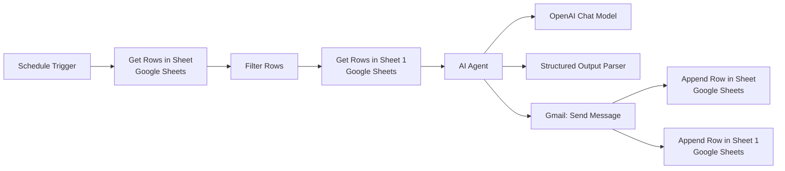
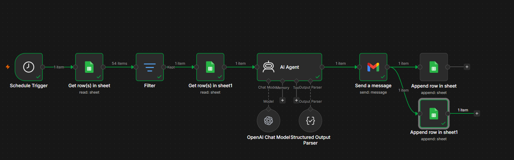

# n8n AI Agent Gmail and Google Sheets Automation

An AI-powered workflow automation built with **n8n**, **OpenAI**, **Gmail**, and **Google Sheets**. This workflow reads spreadsheet data, filters selected rows, processes the data using an AI Agent, sends an email through Gmail, and stores the final output back into Google Sheets.


## Overview

This project demonstrates an end-to-end automation workflow created in n8n.

The workflow starts on a schedule, reads data from Google Sheets, filters the required records, sends the filtered data to an OpenAI-powered AI Agent, sends a Gmail message, and appends the processed result into Google Sheets.

It is useful for automating spreadsheet-based communication tasks where data needs to be checked, processed with AI, emailed, and stored for tracking.

## Features

- Scheduled workflow execution
- Google Sheets data reading
- Row filtering before processing
- OpenAI AI Agent integration
- Structured output parsing
- Gmail message sending
- Automatic result storage in Google Sheets
- End-to-end no-code workflow automation
- Easy to customize for other spreadsheet and email use cases

## Workflow Architecture



```text
Schedule Trigger
      |
      v
Get Rows in Sheet
(Google Sheets)
      |
      v
Filter
      |
      v
Get Rows in Sheet 1
(Google Sheets)
      |
      v
AI Agent
(OpenAI Chat Model)
      |
      v
Structured Output Parser
      |
      v
Send a Message
(Gmail)
      |
      v
Append Row in Sheet
(Google Sheets)
      |
      v
Append Row in Sheet 1
(Google Sheets)
```

## Workflow Process

### Step 1 - Schedule Trigger

The workflow starts automatically using a scheduled trigger.

### Step 2 - Read Data from Google Sheets

The workflow retrieves rows from a Google Sheet.

### Step 3 - Filter Rows

The filter node selects only the rows that match the required condition.

### Step 4 - Read Additional Sheet Data

The workflow retrieves extra data from another Google Sheet node for AI processing.

### Step 5 - AI Agent Processing

The AI Agent uses an OpenAI Chat Model to process the selected spreadsheet data and generate a structured result.

### Step 6 - Parse Structured Output

The Structured Output Parser formats the AI response into a consistent structure that can be used by later nodes.

### Step 7 - Send Gmail Message

The Gmail node sends the generated message or processed result.

### Step 8 - Append Results to Google Sheets

The final output is appended back into Google Sheets for record keeping.

## Tech Stack

| Layer | Technology |
| --- | --- |
| Automation | n8n |
| AI Model | OpenAI Chat Model |
| AI Workflow | n8n AI Agent |
| Email | Gmail |
| Spreadsheet | Google Sheets |
| Data Handling | Filter Node |
| Output Formatting | Structured Output Parser |

## Repository Structure

Current uploaded structure:

```text
repository-name/
|
|-- README.md
|-- workflow-preview.png
|-- workflow.json
```

Recommended structure if you want to organize it further:

```text
repository-name/
|
|-- README.md
|-- .gitignore
|
|-- workflow/
|   |-- workflow.json
|
|-- screenshots/
|   |-- workflow-preview.png
```

If you move the screenshot into the `screenshots` folder, update the image path in this README to:

```md

```

## Installation

### Prerequisites

Before using this workflow, make sure you have:

- n8n account or local n8n setup
- OpenAI API access
- Google account
- Google Sheets access
- Gmail access
- Required n8n credentials configured

### Import Workflow

1. Clone or download this repository.
2. Open your n8n instance.
3. Select **Import workflow**.
4. Import the exported workflow JSON file.
5. Configure the required credentials.
6. Update spreadsheet IDs, sheet names, filters, and Gmail settings.
7. Save and test the workflow.
8. Activate the workflow after successful testing.

## Configuration

Configure the following credentials inside n8n before running the workflow:

- OpenAI API credentials
- Google Sheets credentials
- Gmail credentials

You may also need to update:

- Google Sheet document IDs
- Sheet/tab names
- Filter conditions
- AI Agent prompt
- Structured output schema
- Gmail recipient, subject, and message fields
- Destination sheet for appended results

## Usage

1. Activate or manually test the workflow in n8n.
2. The Schedule Trigger starts the automation.
3. Google Sheets rows are retrieved.
4. Matching rows are filtered.
5. The AI Agent processes the selected data.
6. Gmail sends the generated message.
7. Results are appended back into Google Sheets.

## Example Use Cases

- Automated email generation from spreadsheet data
- Scheduled reporting workflows
- AI-assisted follow-up emails
- Spreadsheet-based task reminders
- Data processing and logging automation
- Gmail and Google Sheets workflow automation

## Security Notes

Before uploading or sharing your workflow publicly, remove private information such as:

- API keys
- Credential IDs
- Private Google Sheet links
- Gmail addresses you do not want public
- Personal or customer data
- Internal business information

Do not commit real credentials to GitHub.

## Future Improvements

- Add Slack or Microsoft Teams notifications
- Add error handling and retry logic
- Add workflow execution logs
- Add multiple email templates
- Add approval steps before sending emails
- Add dashboard/reporting output

## Author

**Harshinee Shree G**

B.Tech - Artificial Intelligence & Data Science

## Topics

- n8n Automation
- OpenAI
- Gmail
- Google Sheets
- AI Agent
- Workflow Automation

## Support

If you found this project helpful, consider giving it a **star** on GitHub.
